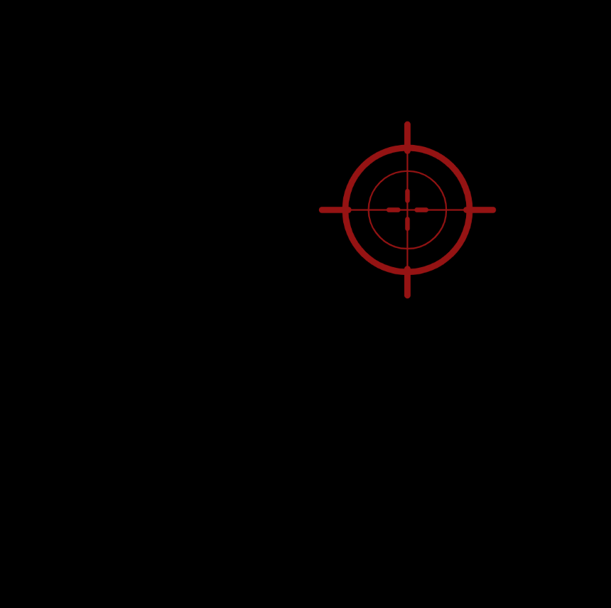

---
---

# Locked Target

Erica Galvez

[View this project online](https://junyawant.github.io/Cart253/codingassignments/prototype-conditionals/prototype-2/)

## Description

This prototype is meant to mimic those aim trainer games that are often present in shooter games to improve ur hand eye coordination and reaction time in fast pace rounds. 

## How It Works

Using the LMB, click around the screen to move the crosshair to mimic shooting a target.

## Attribution

> - This project uses [p5.js](https://p5js.org).
