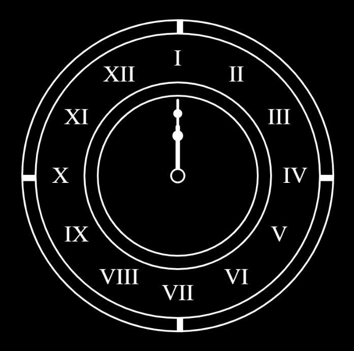

---
---

# Time is ticking

## Erica Galvez

- [View this project online](https://junyawant.github.io/Cart253/codingassignments/prototype-conditionals/prototype-3/)
- [View the code for this project here](https://github.com/junyawant/Cart253/blob/main/codingassignments/prototype-conditionals/prototype-3/js/script.js)

## Description

This prototype is a clock that simulates its use of telling the time. The clock can go both clockwise and counterclockwise depending on the mouse button you chose to hold down!

## How it Works
- Hold down the LMB mouse button to turn the clock closewise
- Hold down the RMB to turn the clock counterclockwise

## Attribution

> - This project uses [p5.js](https://p5js.org).
