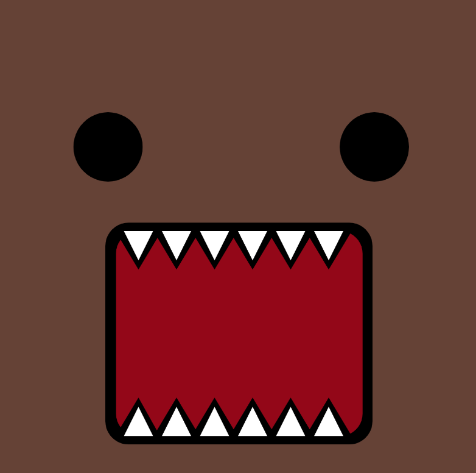

---
---

# domo-monster

## Erica Galvez

- [View this project online](https://junyawant.github.io/Cart253/codingassignments/prototype-instructions/prototype-1/domo-monster/)
- [View the code for this project here](https://github.com/junyawant/Cart253/blob/main/codingassignments/prototype-instructions/prototype-1/domo-monster/js/script.js)

## Description

This is my first prototype for this assignment. 

This is a recreation of the character Domo. He is a brown monster often drawn with a large, open mouth and sharp teeth. 

He has two fully filled black eyes. There is another variation of his character that can sometimes be pink!

## Attribution
> - This project uses [p5.js](https://p5js.org).
