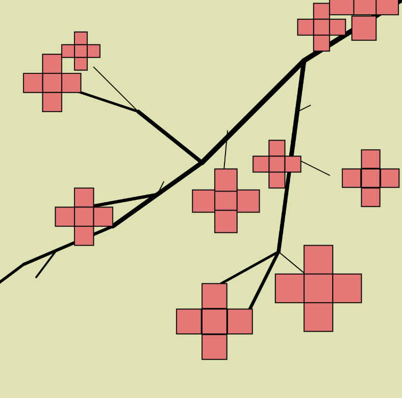

# Plus Flowers

Erica Galvez

[View this project online](https://junyawant.github.io/Cart253/codingassignments/prototype-instructions/prototype-3/abstract-art/)

## Description

This prototype is my 3rd for the assignment: prototype: instructions. It is meant to be more of a weird, yet abstract piece. While it can be obviously seen as flowers on branches, using plus signs as flowers definitely gives it a odd and weird look.

## Attribution

> - This project uses [p5.js](https://p5js.org).