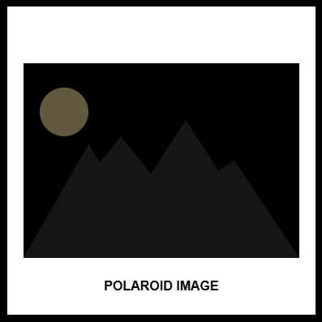

---
---

# Crimson View

## Erica Galvez

- [View this project online](https://junyawant.github.io/Cart253/codingassignments/prototype-variables/prototype-1/)
- [View the code for this project here](https://github.com/junyawant/Cart253/blob/main/codingassignments/prototype-variables/prototype-1/js/script.js)

## Description

This project is my first try at implementing variables to my code! It is meant to mimic that of a Polaroid picture capturing a crimson view/horizon. When using mouse pressed, the background fades from a black to red color! Similar to how polaroid photos usually take some time to develop and show the picture(s) taken through a polaroid camera.

## Attribution

This bit should attribute any code, assets or other elements used taken from other sources. For example:

> - This project uses [p5.js](https://p5js.org).
