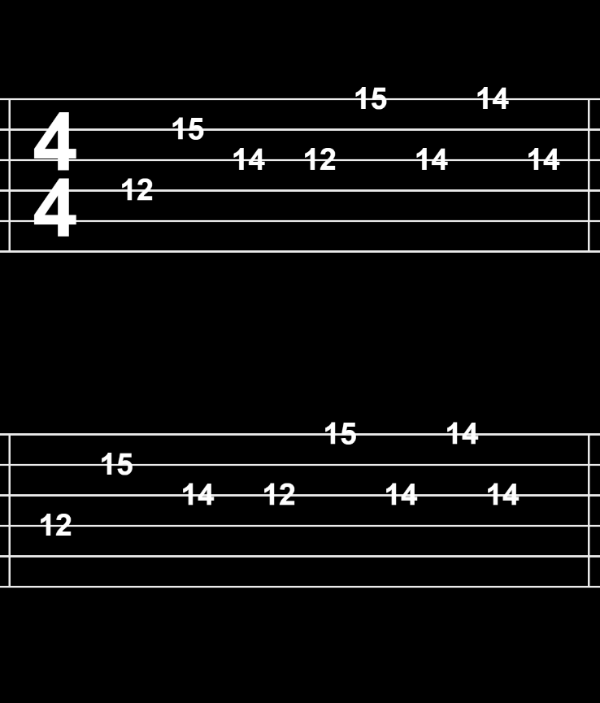

---
---

# Sweet Child O' Mine Tabs

## Erica Galvez

- [View this project online](https://junyawant.github.io/Cart253/codingassignments/prototype-variables/prototype-2/)
- [View the code for this project here](https://github.com/junyawant/Cart253/blob/main/codingassignments/prototype-variables/prototype-2/js/script.js)

## Description

This project is meant to be a recreation of guitar tabs, typically used when learning a song of your choice. I prefer using tabs when learning solos or songs that have beautiful chord/note(s) progressions. In this prototype, the song: Sweet Child O' Mine by Guns N' Roses can be heard by clicking on the tab notes in chronological order.

## Attribution

> - This project uses [p5.js](https://p5js.org).
> - All soundfiles are my own. (personally edited + clipped + converted to mp3)
