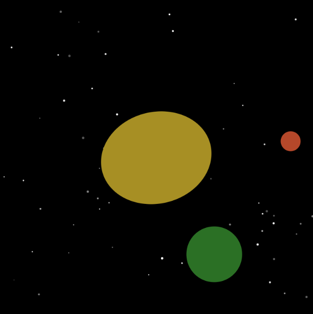

---
---

# Circled Sun

## Erica Galvez

[View this project online](https://junyawant.github.io/Cart253/codingassignments/prototype-variables/prototype-3/)

## Description

This prototype is meant to micmic the rotation of planets around the sun. While the earth and the sun are typically meant to be rotating in the same direction (counterclockwise), I decided to reverse them as it just looks more aesthetically pleasing. In my prototype, 4 things can be seen. (1)Stars, (2)Sun (3)Earth and (4)Mars

## Attribution

> - This project uses [p5.js](https://p5js.org).