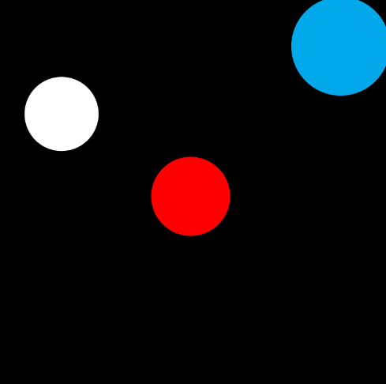

---
---

# Puck

## A project by Erica Galvez, Sabrina Rath & Konstatinos Christodoulakis

[View this project online](https://sabiewasabi.github.io/CART253/topics/conditionals-challenge/)

## Description

This project is meant to simulate a puck (similar to air hockey) that can be moved by the user. When said user moves the puck towards the target in blue, the target will then change color to pink.

This experience is controlled via a mouse while moving your cursor in order to collide with the red puck towards the (blue) target.     

## Attribution

> - This project uses [p5.js](https://p5js.org).
