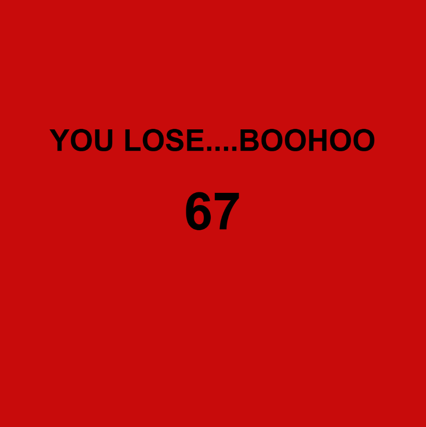

---
---

# Loser Regardless

## A project by Erica Galvez, Sabrina Rath and Konstantinos Christodoulakis

[View this project online](https://junyawant.github.io/Cart253/codingchallenges/events-challenge/)

## Description

This is our attempt at the events challenge! Loser Regardless is a project that no matter what you do, there is no way to win, and inevitably being a loser despite any amount of effort. We have changed its appearance in hopes to make it feel a little more immersive using color!

## How it Works

Any knd of interact with the mouse automatically makes you lose the game, such as:
- Turning your mouse wheel
- Using/Clicking LMB
- Dragging your mouse across the sketch

## Attribution

> - This project uses [p5.js](https://p5js.org).
